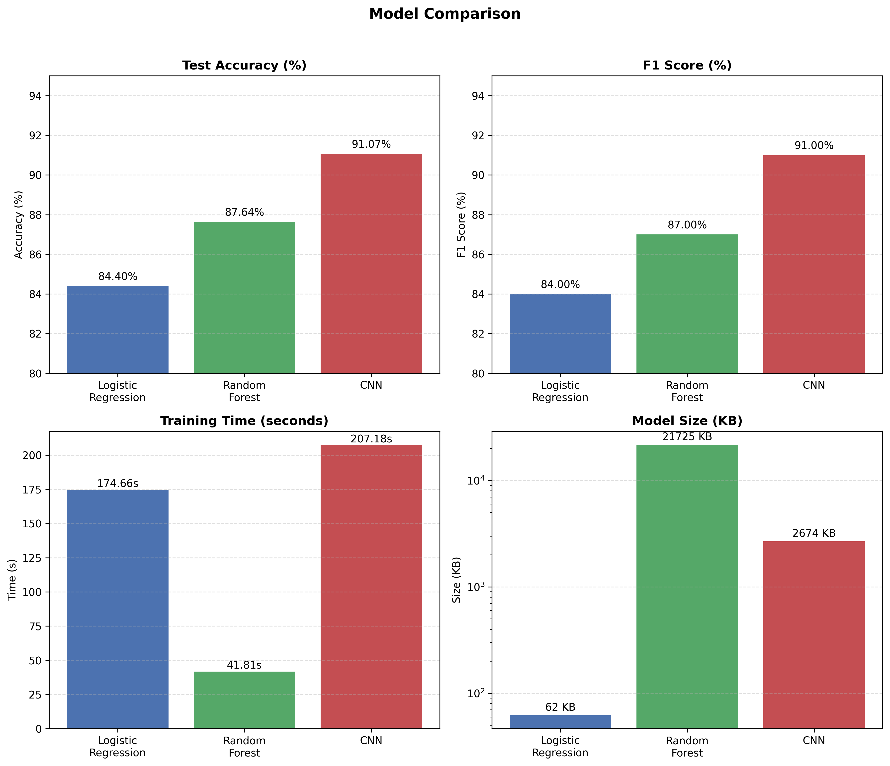

# Clothing Image Classifier

This repository contains machine learning models to classify clothing images into various categories. The models are trained and evaluated using a dataset of labeled clothing images. We are using the [Fashion-MNIST](https://github.com/zalandoresearch/fashion-mnist) dataset (clothing images) for this purpose.

## Models Implemented

1. [Logistic Regression](LogisticRegression.ipynb)
2. [Random Forest Classifier](RandomForest.ipynb)
3. [Convolutional Neural Network (CNN)](CNN.ipynb)

### Requirements

- Python 3.7+
- NumPy
- Pandas
- Scikit-learn
- TensorFlow/Keras
- Matplotlib
- Seaborn
- Jupyter Notebook
- joblib (for model serialization)
- Flask (for web application)
- Plotly (for interactive visualizations)
- Pillow (for image processing)

## Problem Statement and Objective

To classify each 28×28 grayscale image into 1 of 10 garment categories (t-shirt, trouser, pullover, etc.). In general, the model learns from labeled images (training set) and predicts classes on new images (test set).

### Preprocessing and Exploratory Data Analysis (EDA)

- Load the Fashion-MNIST dataset.
- Visualize sample images from the dataset.
- Normalize pixel values to the range [0, 1].
- Analyze class distribution.
- Check for missing values and handle them if any.

### Visualize 20 Sample Clothing Images


### What we know about the dataset?

- 60,000 28x28 grayscale images of 10 fashion categories, along with a test set of 10,000 images.
- Each image is associated with a label from 10 classes.

```py
class_names = [
    "T-shirt/top", "Trouser", "Pullover", "Dress", "Coat",
    "Sandal", "Shirt", "Sneaker", "Bag", "Ankle boot"
]
```

- Each image is represented as a 28x28 array of pixel values ranging from 0 to 255.
- The load_data() function from Keras returns
  - X_train: Training images (60,000 samples)
  - y_train: Training labels (60,000 samples)
  - X_test: Test images (10,000 samples)
  - y_test: Test labels (10,000 samples)

## Data Preprocessing

### Scale the pixel values

- As the pixel values of an image ranges from 0 to 255, indicating the darkness (~0) to lightness (~255) of a pixel.
- We need to scale the data values to the range of 0 to 1 before feeding them to the model.
- This can be done by dividing the pixel values by 255.0.
- This normalization step helps in faster convergence during training.

```py
# Make the pixel values float for better precision
X_train = X_train.astype("float32") / 255.0
X_test = X_test.astype("float32") / 255.0
```

### Reshape the data to 2D arrays

- For models like Logistic Regression and Random Forest, we need to reshape the 28x28 images into 2D arrays of size 784 (28*28).

```py
X_train = X_train.reshape((len(X_train), -1)) # -1 -> 28*28 = 784
X_test = X_test.reshape((len(X_test), -1))
```

## Model Training and Evaluation

- Each model is trained on the training set and evaluated on the test set.
- Performance metrics such as accuracy, precision, recall, and F1-score are calculated to assess model performance.
- Confusion matrices and classification reports are generated for detailed analysis.
- See the respective Jupyter Notebooks for implementation details.

## Conclusion

- The CNN model generally outperforms traditional models like Logistic Regression and Random Forest in image classification tasks.
- Further improvements can be made by tuning hyperparameters, using data augmentation, and experimenting with deeper architectures.
- This project serves as a foundation for building more complex image classification systems in the future.

## Results Summary

| Model | Test Accuracy | F1 Macro | Training Time (s) | Size (KB) | Notes |
|-------|---------------|----------|-------------------|-------|-------|
| Logistic Regression | 84.40% | 0.84 | 174.66 | 62.18 | Linear model, struggles with complex pixel patterns |
| Random Forest | 87.64% | 0.87 | 41.81 | 21725.46 | Captures non-linearity but not spatial structure |
| Convolutional Neural Network | 91.07% | 0.91 | 207.18 | 2673.61 | Learns shapes/textures → best performance |

The results clearly show that deep learning (CNN) significantly outperforms traditional ML models on image data.



## Web Application

An interactive Flask-based web application has been developed to allow users to classify their own clothing images using all three trained models simultaneously.

### Features

- **Interactive Upload Interface**: Drag-and-drop or click-to-browse image upload functionality
- **Real-time Preprocessing Visualization**: View the 28×28 grayscale image that the models actually process
- **Multi-Model Predictions**: Get predictions from CNN, Random Forest, and Logistic Regression simultaneously
- **Confidence Distribution Charts**: Interactive Plotly visualizations showing confidence scores across all 10 categories for each model
- **Responsive Design**: Modern, mobile-friendly UI with smooth animations and transitions
- **Dark Mode Support**: Toggle between light and dark themes for comfortable viewing
- **Educational Content**: Information about the models, dataset, and tips for best results

### See the App in Action

Check out the live demo: [Clothing Image Classifier Web App](https://clothing-image-classifier.example.com)

### Usage

1. Upload a clothing image (preferably on a simple background)
2. Click "Analyze Image" to run predictions
3. View the preprocessed 28×28 image to see what the models process
4. Compare predictions and confidence scores from all three models
5. Explore the confidence distribution charts to understand model behavior

### Technologies Used

- **Backend**: Flask, TensorFlow/Keras, Scikit-learn
- **Frontend**: HTML5, CSS3, JavaScript (ES6+)
- **Visualization**: Plotly.js for interactive charts
- **UI Framework**: Bootstrap 5 with custom styling
- **Icons**: Font Awesome 6

## References

- [Fashion-MNIST Dataset](https://github.com/zalandoresearch/fashion-mnist)
- [Scikit-learn Documentation](https://scikit-learn.org/stable/documentation.html)
- [TensorFlow/Keras Documentation](https://www.tensorflow.org/api_docs)
- [Matplotlib Documentation](https://matplotlib.org/stable/contents.html)
- [Seaborn Documentation](https://seaborn.pydata.org/)
- [NumPy Documentation](https://numpy.org/doc/)
- [Jupyter Notebook Documentation](https://jupyter.org/documentation)
