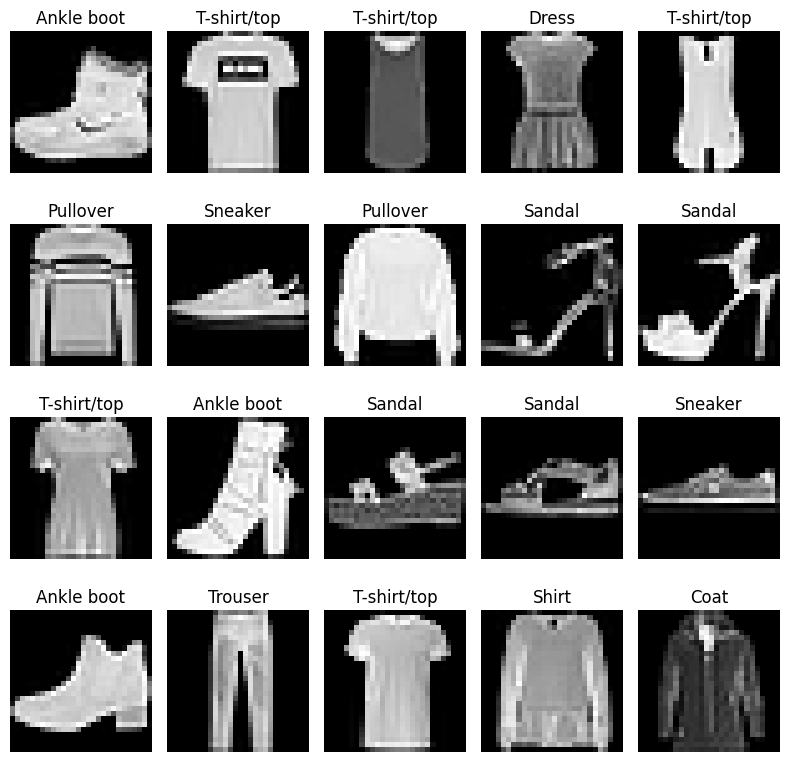

# Clothing Image Classifier

This repository contains machine learning models to classify clothing images into various categories. The models are trained and evaluated using a dataset of labeled clothing images. We are using the [Fashion-MNIST](https://github.com/zalandoresearch/fashion-mnist) dataset (clothing images) for this purpose.

## Models Implemented

1. [Logistic Regression](LogisticRegression.ipynb)
2. [Random Forest Classifier](RandomForest.ipynb)
3. [Convolutional Neural Network (CNN)](CNN.ipynb)

### Requirements

- Python 3.7+
- NumPy
- Pandas
- Scikit-learn
- TensorFlow/Keras
- Matplotlib
- Seaborn
- Jupyter Notebook

## Problem Statement and Objective

To classify each 28×28 grayscale image into 1 of 10 garment categories (t-shirt, trouser, pullover, etc.). In general, the model learns from labeled images (training set) and predicts classes on new images (test set).

### Preprocessing and Exploratory Data Analysis (EDA)

- Load the Fashion-MNIST dataset.
- Visualize sample images from the dataset.
- Normalize pixel values to the range [0, 1].
- Analyze class distribution.
- Check for missing values and handle them if any.

### Visualize 20 Sample Clothing Images



### What we know about the dataset?

- 60,000 28x28 grayscale images of 10 fashion categories, along with a test set of 10,000 images.
- Each image is associated with a label from 10 classes.

```py
class_names = [
    "T-shirt/top", "Trouser", "Pullover", "Dress", "Coat",
    "Sandal", "Shirt", "Sneaker", "Bag", "Ankle boot"
]
```

- Each image is represented as a 28x28 array of pixel values ranging from 0 to 255.
- The load_data() function from Keras returns
  - X_train: Training images (60,000 samples)
  - y_train: Training labels (60,000 samples)
  - X_test: Test images (10,000 samples)
  - y_test: Test labels (10,000 samples)

## Data Preprocessing

### Scale the pixel values

- As the pixel values of an image ranges from 0 to 255, indicating the darkness (~0) to lightness (~255) of a pixel.
- We need to scale the data values to the range of 0 to 1 before feeding them to the model.
- This can be done by dividing the pixel values by 255.0.
- This normalization step helps in faster convergence during training.

```py
# Make the pixel values float for better precision
X_train = X_train.astype("float32") / 255.0
X_test = X_test.astype("float32") / 255.0
```

### Reshape the data to 2D arrays

- For models like Logistic Regression and Random Forest, we need to reshape the 28x28 images into 2D arrays of size 784 (28*28).

```py
X_train = X_train.reshape((len(X_train), -1)) # -1 -> 28*28 = 784
X_test = X_test.reshape((len(X_test), -1))
```

### Train the Model

- Train the Logistic Regression model using the processed training data.

```py
model = LogisticRegression(max_iter=1000, n_jobs=-1)
model.fit(X_train, y_train)
```

- max_iter=1000 allows the model to run for a maximum of 1000 iterations.
- n_jobs=-1 allows the model to use all available CPU cores for training, speeding up the process.

### Evaluate the Model

- Evaluate the model's performance on the test dataset.

```py
y_pred = model.predict(X_test)

test_accuracy = accuracy_score(y_test, y_pred)
print(f"Test Accuracy: {test_accuracy * 100:.2f}%")

print("Classification Report:")
print(classification_report(y_test, y_pred, target_names=class_names))

print("Confusion Matrix:")
plt.figure(figsize=(10, 8))
cm = confusion_matrix(y_test, y_pred)
sb.heatmap(cm, annot=True, fmt="d", cmap="Blues",
           xticklabels=class_names,
           yticklabels=class_names)
plt.ylabel("Actual")
plt.xlabel("Predicted")
plt.title("Confusion Matrix")
plt.tight_layout()
plt.show()
```
